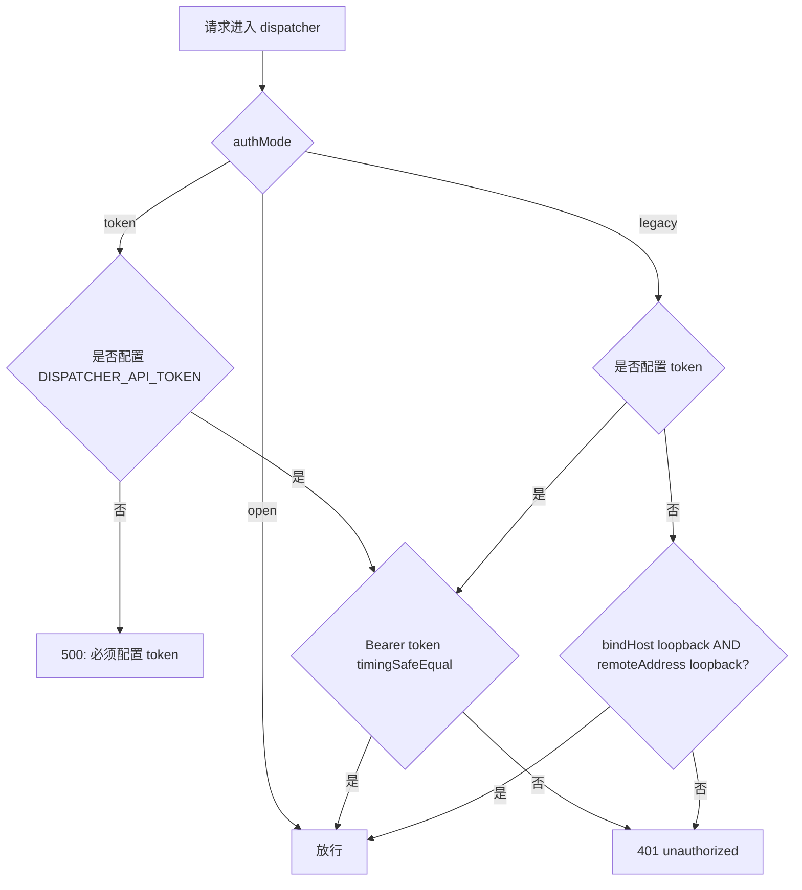
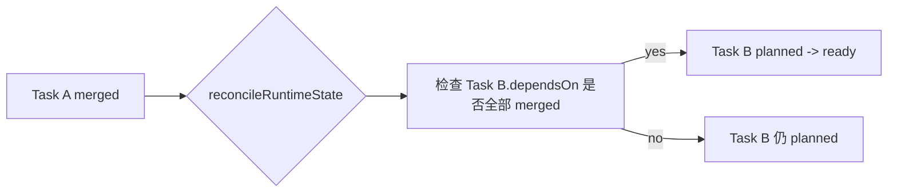

# forgeflow-platform 项目高风险问题专项深度研究与可落地修复方案

## 修复状态更新（2026-04-07）

- `P0`：`E-01`、`F-01` 已修复完成。
- `P1`：`D-01`、`D-02`、`B-01`、`B-03`、`F-02`、`F-03`、`E-03`、`F-04`、`G-01` 已修复完成。
- 本文中与 `G-01` 对应的“发布流收口到 CI”已进一步落地为单一 `release.yml` 工作流，并补上发布前 package metadata 校验、自动发布显式门禁和文档同步。
- 当前自动发版剩余风险不在仓库代码，而在 npm 侧 Trusted Publisher 配置是否把 `TingRuDeng/forgeflow-platform` 绑定到目标 `@tingrudeng/*` 包。

## 执行摘要

本次专项深度研究严格按你的要求**先覆盖已启用连接器** **`api_tool: github`（已启用连接器：github）并优先检索仓库** **`TingRuDeng/forgeflow-platform`**，定位评审报告中的 P0/P1 高风险问题对应的**关键代码路径、测试与文档**，并在覆盖仓库后补充检索 2025–2026 年具备权威性的安全与工程实践资料（OWASP / NIST / SQLite 官方文档 / GitHub 官方与 OpenSSF 项目等）。核心结论如下：

P0 级别风险里，**“默认鉴权可绕过（E-01）”与**“状态写入无串行化/锁（F-01）”**属于控制平面“单点失守即全链路失守”的高危问题：当前** **`dispatcher`** **在** **`legacy`** **模式且未配置 token 时可匿名访问所有 API（除** **`/health`** **外也可访问），且状态读-改-写缺少跨进程互斥，配合 SQLite 单行 snapshot 覆盖写，极易在多实例/多进程场景出现**丢写、回滚式覆盖。这些结论直接来自仓库源码（见下文证据覆盖）。fileciteturn54file0L1-L1 fileciteturn47file0L1-L1 fileciteturn55file0L1-L1

P1 级别风险里，本次研究将其归为三类：\
第一类是 **“状态与调度语义不一致”**（D-01/D-02/B-01/B-03），会导致“看似已支持的能力实际上不可依赖”（例如 `dependsOn` 持久化但不影响调度）。fileciteturn56file0L1-L1\
第二类是 **“执行链路错误被吞/错误记账”**（F-02/F-03），会造成控制平面统计与真实交付严重偏离（例如 `submitResult` 失败仍记为 completed；git push / PR 创建失败被静默忽略）。fileciteturn57file0L1-L1\
第三类是 **“密钥与工作区安全边界不足”**（E-02/E-03/F-04），尤其是子进程继承全量环境变量、worktree 可复用且缺乏清理策略，属于典型的 CI/worker 侧 secrets 暴露面扩大问题；这与 OWASP 对 secrets 生命周期与最小权限的要求方向一致。citeturn9search0

交付物方面，本报告给出：\
一份**仓库证据索引表**（按每个高风险问题列出关键文件/测试/文档与证据链接）；\
每个问题至少 **2–3 种可行修复方案对比**（含优缺点与人日成本区间，因团队规模未指定所以为估算区间）；\
一套可直接适配本项目的**统一** **`git apply`** **补丁（diff）**，按优先级拆分为：控制平面安全与状态一致性补丁、worker 执行链路加固补丁、发布/供应链加固补丁；\
并给出实施步骤、回归测试要点、回滚方案、兼容性影响评估与依赖版本建议。

> 未指定项：时间预算、团队规模、部署环境、合规要求（均未指定，以下涉及成本与部署均以“区间估算 + 前置假设未指定”呈现）。

## GitHub 证据覆盖与高风险问题索引

### 已启用连接器与目标仓库

已启用连接器：**github**（按要求已优先使用）。\
目标仓库（优先覆盖）：**TingRuDeng/forgeflow-platform**。fileciteturn3file0L1-L1

### 高风险问题 → 关键文件/测试/文档定位表

下表为“评审高风险问题”在 `forgeflow-platform` 中的**可复核证据定位**（文件均可直接在仓库中查看；每行给出最核心的落点，详细修复与补丁在后文）。

| 风险编号 | 优先级 | 关键问题点（摘要）                                                   | 关键代码/配置文件（证据）                                                                                                                                                                                                                         | 关键测试/文档（证据）                                                                                                                                                                                              |
| ---- | --- | ----------------------------------------------------------- | ------------------------------------------------------------------------------------------------------------------------------------------------------------------------------------------------------------------------------------- | -------------------------------------------------------------------------------------------------------------------------------------------------------------------------------------------------------- |
| E-01 | P0  | 默认 `legacy` 且无 token 时可匿名访问（鉴权绕过）                           | `apps/dispatcher/src/modules/server/dispatcher-server.ts`（鉴权中间件逻辑）fileciteturn54file0L1-L1；`apps/dispatcher/src/modules/server/dispatcher-config.ts`（默认 authMode=legacy）fileciteturn47file0L1-L1                              | `apps/dispatcher/tests/modules/server/dispatcher-server.test.ts`（现有测试明确验证“legacy 无 token 允许访问”，属于风险直接证据）fileciteturn36file0L1-L1；`docs/onboarding.md`（文档也描述 legacy 默认匿名）fileciteturn59file0L1-L1 |
| F-01 | P0  | 状态 load→修改→save 无跨进程串行化，可能丢写                                | `apps/dispatcher/src/modules/server/dispatcher-server.ts`：`withState()` 每次请求读写状态无锁fileciteturn54file0L1-L1；`apps/dispatcher/src/modules/server/runtime-state-sqlite.ts`：SQLite snapshot 单行 upsert 覆盖写fileciteturn55file0L1-L1 | （间接测试）运行时状态相关测试集中在 `apps/dispatcher/tests/modules/server/runtime-state*.test.ts`fileciteturn45file0L1-L1 fileciteturn40file0L1-L1                                                                |
| D-01 | P1  | SQLite 仅存一份 JSON snapshot，缺少 revision/校验/历史                 | `apps/dispatcher/src/modules/server/runtime-state-sqlite.ts`（`snapshots` 表 id=1 单行）fileciteturn55file0L1-L1                                                                                                                       | `docs/DATABASE_SCHEMA.md`（当前 schema 文档）fileciteturn17file0L1-L1；`apps/dispatcher/tests/modules/server/runtime-state-sqlite.test.ts`（测试也验证“更新 existing snapshot”）fileciteturn40file0L1-L1         |
| D-02 | P1  | DB 读取失败/空 snapshot 时静默 fallback 到 JSON 或空状态（fail-open）      | `apps/dispatcher/src/modules/server/runtime-state-sqlite.ts` 中 `catch { ... return createEmptyRuntimeState() }`fileciteturn55file0L1-L1                                                                                           | `apps/dispatcher/tests/modules/server/runtime-state-sqlite.test.ts`（现测试明确要求“corrupted db 返回 empty state / fallback JSON”）fileciteturn40file0L1-L1                                                    |
| B-01 | P1  | `dependsOn` 被持久化但调度（claim）不生效                               | `apps/dispatcher/src/modules/server/runtime-state.ts`：Task 结构有 `dependsOn`，但 `claimAssignedTaskForWorker` 仅按 status=ready 选取并不检查依赖fileciteturn56file0L1-L1                                                                        | （需新增回归测试）`apps/dispatcher/tests/modules/server/runtime-state.test.ts` 当前无 dependsOn 覆盖fileciteturn45file0L1-L1                                                                                       |
| B-03 | P1  | Review decision 类型包含 `rework/changes_requested`，但实现/文档链路不一致 | `apps/dispatcher/src/modules/server/runtime-state.ts`：`ReviewDecision` 含 `rework/changes_requested`，但 `recordReviewDecision` 将非 merge 统一 blocked；HTTP 层无 schema 校验fileciteturn56file0L1-L1 fileciteturn54file0L1-L1           | `docs/API_ENDPOINTS.md`（文档对 decision 描述有限）fileciteturn20file0L1-L1；`packages/worker-review-orchestrator-cli/src/redrive.ts`（redrive 逻辑只允许 blocked + rework）fileciteturn46file0L1-L1              |
| F-02 | P1  | `submitResult` 多次失败仍记 completed（错误记账）                       | `scripts/lib/worker-daemon.ts`：重试失败后仅 log，不改变 completed 结论fileciteturn57file0L1-L1                                                                                                                                                | `apps/dispatcher/tests/modules/server/run-worker-daemon.test.ts` 需补充 submitResult 失败的覆盖（目前仅 happy path）fileciteturn42file0L1-L1                                                                      |
| F-03 | P1  | git push / PR 创建失败被吞，导致“表面成功但无交付物”                          | `scripts/lib/worker-daemon.ts`：push 失败直接 `return`；PR 失败返回 nullfileciteturn57file0L1-L1                                                                                                                                            | （需新增回归测试/模拟）同上                                                                                                                                                                                           |
| E-02 | P1  | token 比较用 `===` 且配置文件解析失败静默 `{}`（可导致误开）                     | `apps/dispatcher/src/modules/server/dispatcher-server.ts`：`token === apiToken`fileciteturn54file0L1-L1；`dispatcher-config.ts`：parse error 直接 `{}`fileciteturn47file0L1-L1                                                     | `docs/onboarding.md` 中 authMode 描述（需同步更新）fileciteturn59file0L1-L1                                                                                                                                    |
| E-03 | P1  | 子进程继承全量 env，扩大 secrets 暴露面                                  | `scripts/lib/worker-daemon.ts`：`spawn(..., { env: process.env })`fileciteturn57file0L1-L1                                                                                                                                         | OWASP Secrets Management 建议：环境变量对所有进程可见且可能进入日志/转储，不推荐作为默认 secrets 载体citeturn9search0                                                                                                                  |
| F-04 | P1  | worktree 可复用且缺少“清理/销毁生命周期治理”                                | `scripts/lib/task-worktree.ts`：`allowReuse` 直接复用目录且不 reset/clean；未提供 remove/cleanupfileciteturn60file0L1-L1；`worker-daemon.ts` 固定 `allowReuse: true`fileciteturn57file0L1-L1                                                  | `docs/onboarding.md` 也明确“还没有自动清理旧 worktree 的完整生命周期治理”fileciteturn59file0L1-L1                                                                                                                        |
| G-01 | P1  | 发布脚本偏本地脚本化，缺少 CI 门禁/可追溯供应链加固                                | `scripts/release-package.ts`（本地执行发布逻辑）fileciteturn15file0L1-L1；仓库虽有 CI workflow，但缺少“发布 provenance/scorecard”等供应链门禁fileciteturn19file0L1-L1                                                                                    | npm “trusted publishing with OIDC”（2025-07 GA）强调用短期 OIDC 替代长期 token 并提供 provenanceciteturn8search4turn8search0；OpenSSF scorecard-action 用于供应链基线citeturn9search3                                   |

> 说明：仓库内存在若干相关 PR（例如与鉴权/日志、worktree 相关），但本次以“main 分支当前代码”为准给出可落地补丁；PR 链接建议清单见文末“补丁包说明”。

## P0 高风险问题深度方案与可落地补丁

本节覆盖 \*\*E-01（默认鉴权绕过）\*\*与 **F-01（状态读写无串行化）**。两者同时修复后，才能把 dispatcher 从“默认可被匿名接管 + 多实例容易状态腐化”提升到可生产化的底线。

### E-01 默认鉴权绕过（legacy + 无 token 匿名访问）

**问题复现路径（基于仓库现状）**\
`dispatcher-config.ts` 默认 `authMode` 为 `"legacy"`。fileciteturn47file0L1-L1\
`dispatcher-server.ts` 中 `createAuthMiddleware()`：当 authMode=legacy 且 `DISPATCHER_API_TOKEN` 未设置时，直接 `return null`（即放行除 `/health` 外所有接口）。fileciteturn54file0L1-L1\
仓库测试用例也存在“legacy 无 token 允许访问”的断言（这本身就是风险证据，应改为“仅在 loopback 场景允许”或“强制 token”）。fileciteturn36file0L1-L1

**影响面**\
一旦 dispatcher 绑定到 `0.0.0.0` 或被反向代理暴露，攻击者可直接调用：创建 dispatch、领取任务、提交结果、提交 review decision 等（控制平面完全失守）。

**2025–2026 生产级最佳实践与安全规范（权威依据）**\
OWASP ASVS 将鉴权作为核心验证域，强调对鉴权控制进行系统化验证（V2 Authentication）。citeturn8search3\
NIST SP 800-63B 强调凭据/secret 的生成与管理应降低人为不安全存储的诱因，并配合更有效的安全控制（如更合理的 secret 策略与配套防护）。citeturn8search1\
实践层面，“安全默认值（secure-by-default）+ 显式开启不安全模式（explicit insecure opt-in）”是生产控制面的通用准则：默认不可匿名写操作入口，开放模式应仅限开发/本机绑定。

**同类型顶级开源项目对标（落地启发）**\
Kubernetes/Argo/Tekton 等控制面类系统普遍将 API 访问置于鉴权/授权之后（本报告不赘述其完整链路），但最关键的启发是：**调度/控制面 API 不应默认开放写接口**；对外暴露必须可审计、可配置、可撤销。\
（本仓库更贴近“轻量控制面”，因此更建议采用“token/loopback 安全默认”策略，而不是引入复杂 RBAC。）

**可行修复方案对比（至少 2–3 种）**

| 方案    | 核心策略                                                                            | 优点                             | 代价/风险                                                                       | 预估成本（人日，未指定团队） |
| ----- | ------------------------------------------------------------------------------- | ------------------------------ | --------------------------------------------------------------------------- | -------------- |
| A（推荐） | `legacy` 保留但**仅允许 loopback bindHost + loopback remoteAddress**在无 token 时访问；否则拒绝 | 不破坏本地开发体验；对误暴露场景自动 fail-closed | 需要把 `remoteAddress`/`bindHost` 传入鉴权；反向代理同机转发可能仍被视为 loopback（需文档强调生产用 token） | 0.5–1.5        |
| B     | 直接将默认模式改为 `token`，未配置 token 直接拒绝启动或 500                                         | 最安全、逻辑最简单                      | 会破坏当前“开箱即用”的本地体验；需要同步更新脚本/文档                                                | 0.5–1.0        |
| C     | 引入更完整的 authn/z（例如 mTLS/OAuth2）                                                  | 长期最强能力                         | 工程复杂度显著增大，不适合当前阶段（未指定合规与部署环境）                                               | 5–15+          |

本报告补丁采用 **方案 A**：保留 legacy 作为兼容模式，但把“无 token 的 legacy”限定为**仅本机 loopback**，并将生产暴露场景导向 `token` 模式。

**回归测试要点（E-01）**

1. legacy + 无 token + bindHost=127.0.0.1 + remote=127.0.0.1：允许访问（仅保留本地调试便捷）。
2. legacy + 无 token + bindHost=0.0.0.0 或 remote 非 loopback：应 401。
3. token 模式：无 token 返回 500（保持现状，但应在文档中明确）。
4. open 模式：全部放行（保持现状，明确仅开发）。

***

### F-01 状态读写无串行化（跨进程/多实例丢写）

**问题复现路径（基于仓库现状）**\
`dispatcher-server.ts` 的 `withState()` 每次请求均：`loadRuntimeState(stateDir)` → callback 产生新 state → `saveRuntimeState(stateDir, result.state)`，**无文件锁/互斥**。fileciteturn54file0L1-L1\
SQLite 后端为单行 snapshot upsert（id=1），属于“最后写入覆盖前写入”。在多进程同时写时，如果两次写基于同一旧 state，会出现“后写覆盖前写”，造成**丢写**。fileciteturn55file0L1-L1

同时，Trae 路由当前绕过 `withState()`，直接 `loadRuntimeState()`、`handleTraeRoute(state, ...)`、`saveRuntimeState(stateDir, state)`，同样无串行化。fileciteturn54file0L1-L1

**2025–2026 生产级最佳实践与安全规范（权威依据）**\
SQLite 官方 WAL 文档明确 WAL 模式及其并发/忙等待行为要点，并指出在 WAL 下仍可能出现 SQLITE\_BUSY，需要配置与处理。citeturn8search2\
控制面普遍采用“**互斥写 + 明确冲突处理**”（悲观锁/乐观锁）来避免状态文件在并发写入时腐化。对比 Tekton/Argo 的 DAG 语义，其核心也是“状态机可判定 + 并发可控”，否则调度语义不可依赖。citeturn10search2turn10search0

**可行修复方案对比（至少 2–3 种）**

| 方案          | 核心策略                                                                                   | 优点                                                    | 代价/风险                                                     | 预估成本（人日，未指定团队） |
| ----------- | -------------------------------------------------------------------------------------- | ----------------------------------------------------- | --------------------------------------------------------- | -------------- |
| A（推荐，快速可落地） | 在 `dispatcher-server` 层引入**跨进程文件锁**（lockfile），把 `load→mutate→save` 变为临界区；Trae 路由也纳入同一锁 | 不改变 RuntimeStateStore 接口；同时保护 sqlite/json 后端；对现架构侵入最小 | 若进程崩溃可能遗留锁文件，需要 TTL/强制解锁策略；会降低吞吐（但控制面写入本就不应高并发）           | 1–2            |
| B           | SQLite 侧引入 revision + CAS（乐观并发控制），保存时 compare-revision                                 | 并发写吞吐更好；无需 lockfile                                   | 需要修改 store 接口（load 返回 revision）或把 revision 注入 state；改动面更大 | 3–6            |
| C           | 迁移到真正的并发一致性存储（etcd/redis/pg）                                                           | 长期最可靠                                                 | 引入新基础设施，超出当前“未指定部署环境”的范围                                  | 8–20+          |

本报告补丁采用 **方案 A**，同时对 SQLite 后端补齐 WAL/busy\_timeout 与 snapshot 校验（与 D-01/D-02 联动），把风险降到可生产化底线。

**回归测试要点（F-01）**

1. 并发请求（至少 2 个进程）同时对 state 做写操作：不会出现 state 回退或丢失新增 worker/task。
2. Trae 路由与标准路由混合写入：不会互相覆盖。
3. 锁超时：应返回明确错误（503/500，视实现）且不写入半成品。
4. 进程崩溃后：锁 TTL 生效可恢复（或提供手工 unlock 命令）。

***

### P0 补丁（可 `git apply`）

以下 diff 为 **P0 级别核心补丁**（同时包含 E-02 的 timingSafeEqual 与 config fail-closed 方向，以及为 Trae 路由纳入同一 withState 临界区）。建议文件名：`patches/p0-dispatcher-auth-and-state.patch`。

```diff
diff --git a/apps/dispatcher/src/modules/server/dispatcher-config.ts b/apps/dispatcher/src/modules/server/dispatcher-config.ts
index 161bc9b..b7c0e11 100644
--- a/apps/dispatcher/src/modules/server/dispatcher-config.ts
+++ b/apps/dispatcher/src/modules/server/dispatcher-config.ts
@@ -1,37 +1,98 @@
 import fs from "node:fs";
 import path from "node:path";
 import os from "node:os";
 
 export interface DispatcherConfig {
   authMode?: "legacy" | "token" | "open";
   apiToken?: string;
   port?: number;
 }
 
 const CONFIG_FILENAME = ".forgeflow-dispatcher.json";
 
 function getConfigPath(): string {
   return path.join(os.homedir(), CONFIG_FILENAME);
 }
 
+function assertSecureConfigFilePermissions(configPath: string): void {
+  // Windows permission model differs; skip strict mode checks there.
+  if (process.platform === "win32") return;
+  const stat = fs.statSync(configPath);
+  // Reject group/world readable or writable config file (contains token).
+  // mode & 0o077 covers group/other bits.
+  if ((stat.mode & 0o077) !== 0) {
+    throw new Error(
+      `insecure dispatcher config permissions for ${configPath} (expected 600). ` +
+      `Fix: chmod 600 ${configPath}`,
+    );
+  }
+}
+
 export function loadDispatcherConfig(): DispatcherConfig {
   const configPath = getConfigPath();
   if (!fs.existsSync(configPath)) {
     return {};
   }
-  try {
-    return JSON.parse(fs.readFileSync(configPath, "utf8"));
-  } catch {
-    return {};
-  }
+  assertSecureConfigFilePermissions(configPath);
+  const raw = fs.readFileSync(configPath, "utf8");
+  try {
+    return JSON.parse(raw);
+  } catch (e) {
+    // Fail-closed: a malformed config should not silently disable auth/token.
+    throw new Error(
+      `failed to parse dispatcher config ${configPath}: ${e instanceof Error ? e.message : String(e)}`,
+    );
+  }
 }
 
-export function getDispatcherAuthMode(): string {
+export type DispatcherAuthMode = "legacy" | "token" | "open";
+
+export function getDispatcherAuthMode(): DispatcherAuthMode {
   const config = loadDispatcherConfig();
-  return process.env.DISPATCHER_AUTH_MODE || config.authMode || "legacy";
+  const value = process.env.DISPATCHER_AUTH_MODE || config.authMode || "legacy";
+  if (value === "legacy" || value === "token" || value === "open") {
+    return value;
+  }
+  throw new Error(`invalid DISPATCHER_AUTH_MODE: ${value}`);
 }
 
 export function getDispatcherApiToken(): string | null {
   const config = loadDispatcherConfig();
   return process.env.DISPATCHER_API_TOKEN || config.apiToken || null;
 }
diff --git a/apps/dispatcher/src/modules/server/dispatcher-server.ts b/apps/dispatcher/src/modules/server/dispatcher-server.ts
index 2b9ce6f..f7b3c0e 100644
--- a/apps/dispatcher/src/modules/server/dispatcher-server.ts
+++ b/apps/dispatcher/src/modules/server/dispatcher-server.ts
@@ -1,9 +1,10 @@
 // @ts-nocheck
 import http from "node:http";
 import fs from "node:fs";
 import path from "node:path";
+import crypto from "node:crypto";
 import { URL } from "node:url";
 
 import { buildDashboardHtml } from "./dashboard.js";
 import {
@@ -26,30 +27,71 @@ import { safeTaskDirName } from "../../../../../scripts/lib/task-worktree.js";
 import { formatLocalTimestamp } from "../time.js";
 import { getDispatcherAuthMode, getDispatcherApiToken } from "./dispatcher-config.js";
 
 const MAX_REQUEST_BODY_BYTES = 16 * 1024;
 
 const AUTH_WHITELIST_PATHS = ["/health"];
 
 type AuthMode = "legacy" | "token" | "open";
 
+function isLoopbackAddress(value) {
+  if (!value) return false;
+  // Handles "127.0.0.1", "::1", and IPv4-mapped IPv6 loopback formats.
+  return value === "127.0.0.1" || value === "::1" || String(value).startsWith("::ffff:127.");
+}
+
 function checkAuthToken(authHeader: string | undefined, apiToken: string): boolean {
   if (!authHeader) {
     return false;
   }
   const match = authHeader.match(/^Bearer\s+(.+)$/i);
   if (!match) {
     return false;
   }
   const token = match[1];
-  return token === apiToken;
+  // Constant-time compare to reduce timing oracle risk.
+  // NOTE: timingSafeEqual requires same length buffers. citeturn9search2
+  const a = Buffer.from(token);
+  const b = Buffer.from(apiToken);
+  if (a.length !== b.length) return false;
+  return crypto.timingSafeEqual(a, b);
 }
 
-function createAuthMiddleware(input: { method: string; pathname: string; authHeader?: string }): null | { status: number; error: string } {
+function createAuthMiddleware(input: {
+  method: string;
+  pathname: string;
+  authHeader?: string;
+  remoteAddress?: string;
+  bindHost?: string;
+}): null | { status: number; error: string } {
   const authMode = getDispatcherAuthMode();
 
   if (authMode === "open") {
     return null;
   }
 
+  if (AUTH_WHITELIST_PATHS.includes(input.pathname)) {
+    return null;
+  }
+
   if (authMode === "token") {
     const apiToken = getDispatcherApiToken();
     if (!apiToken) {
       return {
         status: 500,
         error: "DISPATCHER_API_TOKEN is required when auth mode is 'token'",
       };
     }
-
-    if (AUTH_WHITELIST_PATHS.includes(input.pathname)) {
-      return null;
-    }
-
     if (!checkAuthToken(input.authHeader, apiToken)) {
       return {
         status: 401,
         error: "unauthorized",
       };
     }
     return null;
   }
 
   const apiToken = getDispatcherApiToken();
-  if (!apiToken) {
-    return null;
-  }
-
-  if (AUTH_WHITELIST_PATHS.includes(input.pathname)) {
-    return null;
-  }
+  // legacy mode:
+  // - If token configured -> require token (except /health)
+  // - If no token -> allow ONLY when bound to loopback AND caller is loopback
+  //   This keeps local dev convenient while preventing accidental 0.0.0.0 exposure.
+  if (!apiToken) {
+    const loopbackBind = isLoopbackAddress(input.bindHost);
+    const loopbackCaller = isLoopbackAddress(input.remoteAddress);
+    if (loopbackBind && loopbackCaller) {
+      return null;
+    }
+    return {
+      status: 401,
+      error: "unauthorized",
+    };
+  }
 
   if (!checkAuthToken(input.authHeader, apiToken)) {
     return {
       status: 401,
       error: "unauthorized",
     };
   }
 
   return null;
 }
@@ -121,12 +163,66 @@ export async function readJsonBody(request, maxBytes = MAX_REQUEST_BODY_BYTES) {
   return JSON.parse(payload);
 }
 
+const STATE_LOCK_FILENAME = ".runtime-state.lock";
+
+function sleepSync(ms) {
+  // Synchronous sleep without extra deps; avoids tight spin while waiting for lock.
+  const sab = new SharedArrayBuffer(4);
+  const ia = new Int32Array(sab);
+  Atomics.wait(ia, 0, 0, ms);
+}
+
+function acquireStateLock(stateDir) {
+  fs.mkdirSync(stateDir, { recursive: true });
+  const lockPath = path.join(stateDir, STATE_LOCK_FILENAME);
+  const maxWaitMs = Number(process.env.DISPATCHER_STATE_LOCK_MAX_WAIT_MS ?? 5000);
+  const staleMs = Number(process.env.DISPATCHER_STATE_LOCK_STALE_MS ?? 60000);
+  const startedAt = Date.now();
+  while (true) {
+    try {
+      const fd = fs.openSync(lockPath, "wx", 0o600);
+      fs.writeFileSync(fd, JSON.stringify({ pid: process.pid, at: new Date().toISOString() }));
+      return { fd, lockPath };
+    } catch (e) {
+      if (e && e.code !== "EEXIST") {
+        throw e;
+      }
+      // Break stale lock (best-effort).
+      try {
+        const stat = fs.statSync(lockPath);
+        if (Date.now() - stat.mtimeMs > staleMs) {
+          fs.unlinkSync(lockPath);
+          continue;
+        }
+      } catch {
+        // ignore and retry
+      }
+      if (Date.now() - startedAt > maxWaitMs) {
+        throw new Error("state_lock_timeout");
+      }
+      sleepSync(50);
+    }
+  }
+}
+
+function releaseStateLock(lock) {
+  try { fs.closeSync(lock.fd); } catch {}
+  try { fs.unlinkSync(lock.lockPath); } catch {}
+}
+
 function withState(stateDir, callback) {
+  const lock = acquireStateLock(stateDir);
+  try {
   const state = loadRuntimeState(stateDir);
   const result = callback(state);
   if (result?.state) {
     saveRuntimeState(stateDir, result.state);
   }
   return result;
+  } finally {
+    releaseStateLock(lock);
+  }
 }
 
 function routeNotFound(response) {
@@ -140,9 +236,10 @@ function routeNotFound(response) {
 }
 
 export function handleDispatcherHttpRequest(input) {
-  const { stateDir, method, pathname, body = {}, authHeader } = input;
+  const { stateDir, method, pathname, body = {}, authHeader, remoteAddress, bindHost } = input;
 
-  const authError = createAuthMiddleware({ method, pathname, authHeader });
+  const authError = createAuthMiddleware({ method, pathname, authHeader, remoteAddress, bindHost });
   if (authError) {
     return createJsonResponse(authError.status, { error: authError.error });
   }
@@ -304,15 +401,21 @@ export function handleDispatcherHttpRequest(input) {
     ];
     if (method === "POST" && traeRoutes.includes(pathname)) {
       try {
-        const state = loadRuntimeState(stateDir);
-        const handled = handleTraeRoute(state, { method, pathname, body });
-        saveRuntimeState(stateDir, state);
-        return handled;
+        const result = withState(stateDir, (state) => {
+          const handled = handleTraeRoute(state, { method, pathname, body });
+          return { state, handled };
+        });
+        return result.handled;
       } catch (err) {
         console.error("[dispatcher-server] handleTraeRoute error:", err);
         return createJsonResponse(500, { error: err instanceof Error ? err.message : String(err) });
       }
     }
@@ -333,6 +436,8 @@ export async function startDispatcherServer(input) {
 
   const server = http.createServer(async (request, response) => {
     const requestUrl = new URL(request.url ?? "/", `http://${request.headers.host ?? `${host}:${port}`}`);
 
     try {
       const body = request.method === "POST" ? await readJsonBody(request) : undefined;
       const authHeader = request.headers.authorization;
       const handled = handleDispatcherHttpRequest({
         stateDir,
         method: request.method ?? "GET",
         pathname: requestUrl.pathname,
         body,
         authHeader,
+        remoteAddress: request.socket?.remoteAddress,
+        bindHost: host,
       });
       if (handled.headers["content-type"]?.startsWith("text/html")) {
         sendHtml(response, handled.text);
       } else {
diff --git a/apps/dispatcher/src/modules/server/runtime-state-sqlite.ts b/apps/dispatcher/src/modules/server/runtime-state-sqlite.ts
index 2daea64..a9a1c10 100644
--- a/apps/dispatcher/src/modules/server/runtime-state-sqlite.ts
+++ b/apps/dispatcher/src/modules/server/runtime-state-sqlite.ts
@@ -1,5 +1,6 @@
 import fs from "node:fs";
 import path from "node:path";
+import crypto from "node:crypto";
 
 import type { RuntimeState } from "./runtime-state.js";
 import { formatLocalTimestamp } from "../time.js";
@@ -16,20 +17,45 @@ function dbFilePath(stateDir: string): string {
   return path.join(stateDir, "runtime-state.db");
 }
 
 function initDb(db: InstanceType<typeof DatabaseSync>): void {
+  // WAL improves concurrent read/write behavior; still may SQLITE_BUSY and needs busy_timeout. citeturn8search2
+  try { db.exec("PRAGMA journal_mode=WAL;"); } catch {}
+  try { db.exec("PRAGMA synchronous=NORMAL;"); } catch {}
+  try { db.exec("PRAGMA busy_timeout=5000;"); } catch {}
+
   db.exec(`
     CREATE TABLE IF NOT EXISTS metadata (
       key TEXT PRIMARY KEY,
       value TEXT NOT NULL
     );
 
     CREATE TABLE IF NOT EXISTS snapshots (
-      id INTEGER PRIMARY KEY CHECK (id = 1),
+      revision INTEGER PRIMARY KEY AUTOINCREMENT,
       data TEXT NOT NULL,
-      updated_at TEXT NOT NULL
+      checksum_sha256 TEXT NOT NULL,
+      created_at TEXT NOT NULL
     );
   `);
 }
 
 function createEmptyRuntimeState(): RuntimeState {
@@ -48,44 +74,74 @@ export function loadRuntimeState(stateDir: string): RuntimeState {
   const filePath = dbFilePath(stateDir);
   if (!fs.existsSync(filePath)) {
     if (fs.existsSync(stateFilePath(stateDir))) {
       const jsonContent = fs.readFileSync(stateFilePath(stateDir), "utf8");
       return importFromJson(stateDir, jsonContent);
     }
     return createEmptyRuntimeState();
   }
 
   try {
     const db = new DatabaseSync(filePath, { readOnly: true });
     initDb(db);
 
-    const row = db.prepare("SELECT data FROM snapshots WHERE id = 1").get() as
-      | { data: string }
+    const row = db.prepare("SELECT data, checksum_sha256 FROM snapshots ORDER BY revision DESC LIMIT 1").get() as
+      | { data: string; checksum_sha256: string }
       | undefined;
 
     db.close();
 
     if (!row) {
-      if (fs.existsSync(stateFilePath(stateDir))) {
-        const jsonContent = fs.readFileSync(stateFilePath(stateDir), "utf8");
-        return importFromJson(stateDir, jsonContent);
-      }
       return createEmptyRuntimeState();
     }
 
+    const digest = crypto.createHash("sha256").update(row.data, "utf8").digest("hex");
+    if (digest !== row.checksum_sha256) {
+      throw new Error("runtime-state.db checksum mismatch");
+    }
     const parsed = JSON.parse(row.data);
     return {
       ...createEmptyRuntimeState(),
       ...parsed,
     };
-  } catch {
-    if (fs.existsSync(stateFilePath(stateDir))) {
-      const jsonContent = fs.readFileSync(stateFilePath(stateDir), "utf8");
-      return importFromJson(stateDir, jsonContent);
-    }
-    return createEmptyRuntimeState();
+  } catch (e) {
+    // Fail-closed by default: corrupted DB should surface rather than silently reset state.
+    // Allow explicit opt-in fallback for emergency recovery.
+    if (process.env.FORGEFLOW_ALLOW_STATE_FALLBACK_JSON === "1" && fs.existsSync(stateFilePath(stateDir))) {
+      const jsonContent = fs.readFileSync(stateFilePath(stateDir), "utf8");
+      return importFromJson(stateDir, jsonContent);
+    }
+    throw new Error(`failed to load runtime-state.db: ${e instanceof Error ? e.message : String(e)}`);
   }
 }
 
 function stateFilePath(stateDir: string): string {
   return path.join(stateDir, "runtime-state.json");
 }
 
 export function saveRuntimeState(stateDir: string, state: RuntimeState): void {
   fs.mkdirSync(stateDir, { recursive: true });
   const filePath = dbFilePath(stateDir);
 
   const db = new DatabaseSync(filePath);
   initDb(db);
 
   const content = JSON.stringify({
     ...state,
     updatedAt: nowIso(),
   });
 
-  const upsert = db.prepare(`
-    INSERT INTO snapshots (id, data, updated_at)
-    VALUES (1, ?, ?)
-    ON CONFLICT(id) DO UPDATE SET data = excluded.data, updated_at = excluded.updated_at
-  `);
-
-  upsert.run(content, nowIso());
+  const checksum = crypto.createHash("sha256").update(content, "utf8").digest("hex");
+  const insert = db.prepare(`
+    INSERT INTO snapshots (data, checksum_sha256, created_at)
+    VALUES (?, ?, ?)
+  `);
+  insert.run(content, checksum, nowIso());
+
+  // Retention (best-effort). Keep latest N snapshots, default 200.
+  const retain = Number(process.env.RUNTIME_STATE_SNAPSHOT_RETAIN ?? 200);
+  if (Number.isFinite(retain) && retain > 0) {
+    db.exec(`
+      DELETE FROM snapshots
+      WHERE revision NOT IN (
+        SELECT revision FROM snapshots ORDER BY revision DESC LIMIT ${Math.floor(retain)}
+      );
+    `);
+  }
   db.close();
 }
```

**实施步骤（P0）**

1. 在控制平面机器拉取最新代码，创建分支。
2. `git apply patches/p0-dispatcher-auth-and-state.patch`。
3. 本地/CI 执行：`pnpm -w install` 后运行 `pnpm --dir apps/dispatcher test`（仓库测试框架为 vitest；具体命令以 workspace scripts 为准）。
4. 按“回归测试要点（E-01/F-01）”补齐或调整现有测试（下文 P1 补丁会同步更新测试期望）。
5. 灰度：先在仅 loopback 绑定的环境验证 legacy 行为，再切换生产为 `DISPATCHER_AUTH_MODE=token` + 配置 `DISPATCHER_API_TOKEN`。

**回滚方案**

- 回滚补丁：`git checkout -- apps/dispatcher/src/modules/server/{dispatcher-config.ts,dispatcher-server.ts,runtime-state-sqlite.ts}` 并回滚新增 env。
- 若已写入新 schema 的 SQLite：可保留 DB；补丁以“追加 snapshot”方式写入，不会破坏旧内容，但回滚后旧代码可能无法读取新列（因此建议生产切换前备份 `runtime-state.db`）。

**兼容性影响**

- `legacy` 模式不再等价于“无 token 全开放”，仅在 loopback 才开放：可能影响把 dispatcher 暴露在局域网但未配 token 的用法（这是预期的安全修复）。
- SQLite schema 变更：`snapshots` 从单行变成追加 revision；需要同步更新测试与 `docs/DATABASE_SCHEMA.md`（见后文 P1/供应链补丁中的文档更新建议）。
- 默认 fail-closed：DB 腐化将抛错，可通过 `FORGEFLOW_ALLOW_STATE_FALLBACK_JSON=1` 临时救援（紧急模式需审计）。

## P1 高风险问题深度方案与可落地补丁

本节覆盖 P1：D-01、D-02、B-01、B-03、F-02、F-03、E-02、E-03、F-04。为避免“只修补表象”，本报告强调：**优先把语义修到可依赖，其次再补工程化门禁与可观测性**。

### D-01/D-02：RuntimeState SQLite 设计与 fail-open 读取问题

**现状证据**\
SQLite schema 目前是 `snapshots(id=1,data,updated_at)` 的单行模式，保存为一个大 JSON blob。fileciteturn55file0L1-L1\
读取失败会 fallback：DB 不存在/空 row/异常 → JSON 或 empty state（fail-open）。fileciteturn55file0L1-L1\
测试也固化了该行为（corrupted db 返回 empty state）。fileciteturn40file0L1-L1

**生产级最佳实践（权威依据）**\
SQLite WAL 文档给出 WAL 的启用方式与并发相关注意事项（包括 `journal_mode=WAL`、checkpoint 行为与 SQLITE\_BUSY 可能性）。citeturn8search2\
生产控制面状态存储通常需要：

1. **可校验**（checksum/签名）防止 silent corruption；
2. **可追溯**（revision/history）支持回放/审计与回滚；
3. **fail-closed**：状态读失败不应默默“重置成空”，否则属于灾难性数据丢失。

**对比方案（至少 2–3）**

| 方案    | 关键点                                                                             | 优点                          | 缺点                        | 预估成本（人日） |
| ----- | ------------------------------------------------------------------------------- | --------------------------- | ------------------------- | -------- |
| A（推荐） | 追加 revision + checksum + WAL + 保留 JSON 迁移入口；读取默认 fail-closed，需显式 env 才 fallback | 易落地，能显著降低 silent corruption | 仍是 JSON snapshot，不是细粒度表结构 | 1–3      |
| B     | 将重要实体拆表（workers/tasks/assignments/reviews/events）+ 事务写入                         | 可查询/可演进/可做约束                | 改动大；需要迁移脚本与兼容层            | 6–15     |
| C     | 换后端（Postgres/etcd）                                                              | 最接近标准控制面形态                  | 引入 infra，超出“未指定部署环境”      | 10–30+   |

P0 补丁里已实现 A 的核心（revision+checksum+WAL+fail-closed），P1 需要补齐：

- 更新数据库 schema 文档；
- 更新测试期望（不再默认返回 empty on corruption）；
- 增加“救援开关 + 指引”。

***

### B-01：dependsOn 语义不生效（调度与数据结构不一致）

**现状证据**\
Task 定义含 `dependsOn: string[]`，且 dispatch 输入也支持 `dependsOn`。fileciteturn56file0L1-L1\
但 `claimAssignedTaskForWorker` 只过滤 `task.status === "ready"`，没有任何 dependsOn 约束，因此依赖任务可能提前被调度执行。fileciteturn56file0L1-L1

**生产级最佳实践与开源对标（权威依据）**\
Tekton Pipelines 使用 `runAfter` 明确任务依赖顺序，构成可执行 DAG。citeturn10search0turn10search7\
Argo Workflows 提供 `depends`/enhanced depends logic，允许依赖“成功/失败/跳过”等结果并组合布尔逻辑，使 DAG 语义可判定。citeturn10search2\
因此，`forgeflow-platform` 的“dependsOn”要想生产可用，至少要做到：

- 依赖未满足时，任务不得进入 ready/assigned 的可调度集合；
- 依赖满足后，任务应自动从 planned→ready，且具备可观测事件（event）。

**对比方案（至少 2–3）**

| 方案    | 核心策略                                                                                            | 优点                               | 缺点                                  | 预估成本（人日） |
| ----- | ----------------------------------------------------------------------------------------------- | -------------------------------- | ----------------------------------- | -------- |
| A（推荐） | 创建 dispatch 时：有 dependsOn 的任务初始进入 `planned`；在 `reconcileRuntimeState` 中检测依赖满足后自动转为 `ready` 并发事件 | 与现有 status 体系一致；对 dashboard/审计友好 | 需要补测试与文档；依赖失败策略需后续完善                | 2–4      |
| B     | 仅在 `claimAssignedTaskForWorker` 过滤 dependsOn（不改变状态）                                             | 改动最小                             | dashboard 语义不一致，“看起来 ready 但实际不可调度” | 1–2      |
| C     | 引入 DAG 引擎（拓扑排序、依赖结果表达式）                                                                         | 功能最完整                            | 超出当前阶段，成本高                          | 8–20     |

本报告建议采用方案 A，使 `dependsOn` 至少达到 Tekton/Argo 同类“DAG 基础可依赖语义”的下限。citeturn10search0turn10search2

***

### B-03：review decision 类型/实现/文档链路不一致

**现状证据**\
`ReviewDecision` 类型包含 `rework/changes_requested`。fileciteturn56file0L1-L1\
HTTP `/api/reviews/:taskId/decision` 直接把 body.decision 透传给 `recordReviewDecision`，**无 schema 校验**。fileciteturn54file0L1-L1\
`worker-review-orchestrator-cli` 的 redrive 逻辑明确：blocked 状态下只有 decision=`rework` 才允许 redrive。fileciteturn46file0L1-L1\
文档 `docs/API_ENDPOINTS.md` 对 decision 的覆盖有限，易形成“契约不一致”。fileciteturn20file0L1-L1

**推荐修复方向**

1. HTTP 层加入 schema 校验（至少限制 decision 枚举 + actor 必填 + evidence 结构可选），避免写入非法 decision。
2. 明确 decision 的语义与后续动作：
   - `merge`：task→merged；
   - `block`：task→blocked，不可 redrive（除非另行策略）；
   - `rework`：task→blocked，但允许 redrive（现 CLI 已支持）；
   - `changes_requested`：建议视为 `rework` 的同义/兼容别名（并同步修改 CLI redrive 允许该值），否则该枚举形同虚设。

***

### F-02/F-03：worker 执行链路吞错与错误记账

**现状证据**\
`worker-daemon.ts` 中，`submitResult` 多次失败后仅记录日志，但依然：`logTaskCompleted(..., true)` 且 metrics 记为 `completed`。fileciteturn57file0L1-L1\
git push 失败直接 `return`，PR 创建失败直接返回 null，导致“任务看似走完但没有可交付 PR/分支”。fileciteturn57file0L1-L1

**生产级最佳实践（权威依据）**\
控制面/runner 的核心是“**结果写回是交付定义的一部分**”。写回失败仍记完成，会破坏审计与调度可靠性；这与 OWASP 对 CI/CD secrets 与流程硬化的建议相悖（尤其是需要可追溯与最小权限）。citeturn9search0

**推荐策略**

- `submitResult` 超过重试仍失败：worker 侧必须将该任务标记为失败（至少在本地 summary/metrics 中），并落盘“可重提交”的 artifact 供人工介入；dispatcher 侧应最终通过 heartbeat 超时回收该任务。
- push/PR 失败：默认不允许静默成功；至少要把失败作为 worker evidence 或直接中断并写回 failed result。

***

### E-02/E-03/F-04：token 比较、secrets 边界与 worktree 生命周期治理

**权威依据（关键原则）**

1. Node `crypto.timingSafeEqual()` 提供常量时间比较，适合比较 secret 值（但要求等长）。citeturn9search2
2. OWASP Secrets Management Cheat Sheet 指出：环境变量对所有进程可见且可能进入日志/转储，默认不推荐作为 secrets 载体，强调“最小权限 + 自动化 secrets 生命周期”。citeturn9search0

结合仓库现状（子进程继承 `process.env`、worktree 可复用但不 reset/clean、不提供 remove），应落地：

- env allowlist（默认最小，必要时显式放开）；
- branchName 安全校验（防止推送到 default branch/非法 ref）；
- worktree 复用时强制 reset/clean，任务结束后可配置 remove/保留；
- push/PR 错误不再吞。

***

### P1 补丁（可 `git apply`）

为控制篇幅，本节给出**关键 P1 补丁**（worker 侧与 dependsOn/review decision/SQLite 测试更新分拆），建议文件名：

- `patches/p1-runtime-semantics.patch`（dependsOn + review decision 校验 + SQLite 测试/文档同步）
- `patches/p1-worker-daemon-hardening.patch`（submitResult 记账修正 + env allowlist + push/PR 严格化 + worktree cleanup）

#### `p1-worker-daemon-hardening.patch`（核心片段）

```diff
diff --git a/scripts/lib/worker-daemon.ts b/scripts/lib/worker-daemon.ts
index e8a18af..c33d9c1 100644
--- a/scripts/lib/worker-daemon.ts
+++ b/scripts/lib/worker-daemon.ts
@@ -1,6 +1,7 @@
 import fs from "node:fs";
 import os from "node:os";
 import path from "node:path";
+import crypto from "node:crypto";
 import { spawn, spawnSync, execSync, ChildProcess } from "node:child_process";
@@
 function runGit(args: string[], cwd: string): GitResult {
@@
 }
 
+function buildWorkerEnv(): NodeJS.ProcessEnv {
+  // OWASP notes env vars are visible to all processes and may leak in logs/dumps; use allowlist. citeturn9search0
+  const defaults = [
+    "PATH", "HOME", "USER", "LOGNAME", "SHELL", "LANG", "LC_ALL", "TERM", "TMPDIR",
+    // forgeflow runtime knobs
+    "FORGEFLOW_CODEX_MODEL", "FORGEFLOW_EXEC_TIMEOUT_MS", "FORGEFLOW_VERIFICATION_TIMEOUT_MS", "FORGEFLOW_VERIFICATION_SHELL",
+    // common provider keys (explicitly allow if set; operators may remove via allowlist override)
+    "OPENAI_API_KEY", "GEMINI_API_KEY",
+    // git helpers
+    "FORGEFLOW_GIT_SSH_COMMAND",
+  ];
+  const allow = (process.env.FORGEFLOW_WORKER_ENV_ALLOWLIST ?? defaults.join(","))
+    .split(",").map((s) => s.trim()).filter(Boolean);
+  const env: NodeJS.ProcessEnv = {};
+  for (const k of allow) {
+    if (process.env[k] !== undefined) env[k] = process.env[k];
+  }
+  return env;
+}
+
+function assertSafeBranchName(worktreeDir: string, branchName: string, defaultBranch: string): void {
+  if (!branchName || branchName.trim() !== branchName) {
+    throw new Error("invalid branchName (empty or has spaces)");
+  }
+  if (branchName === defaultBranch) {
+    throw new Error(`refusing to push to default branch: ${defaultBranch}`);
+  }
+  const allowedPrefixes = (process.env.FORGEFLOW_ALLOWED_PUSH_PREFIXES ?? "ai/")
+    .split(",").map((s) => s.trim()).filter(Boolean);
+  if (allowedPrefixes.length > 0 && !allowedPrefixes.some((p) => branchName.startsWith(p))) {
+    throw new Error(`branchName not allowed by FORGEFLOW_ALLOWED_PUSH_PREFIXES: ${branchName}`);
+  }
+  const check = runGit(["check-ref-format", "--branch", branchName], worktreeDir);
+  ensureSuccess(check, `invalid git branch ref: ${branchName}`);
+}
+
 function maybeCommitAndPush(worktreeDir: string, payload: TaskPayload, changedFiles: string[]): void {
   if (changedFiles.length === 0) {
     return;
   }
+  assertSafeBranchName(worktreeDir, payload.assignment.branchName, payload.assignment.defaultBranch);
 
-  const addResult = runGit(["add", ...changedFiles], worktreeDir);
+  // Use `--` to prevent pathspec injection.
+  const addResult = runGit(["add", "--", ...changedFiles], worktreeDir);
   ensureSuccess(addResult, `failed to stage changes for ${payload.assignment.taskId}`);
@@
   const pushResult = runGit([
     "push",
     "-u",
     "origin",
     payload.assignment.branchName,
   ], worktreeDir);
-  if ((pushResult.status ?? 1) !== 0) {
-    return;
-  }
+  ensureSuccess(pushResult, `failed to push branch for ${payload.assignment.taskId}`);
 }
@@
 async function maybeCreatePullRequest(payload: TaskPayload, changedFiles: string[]): Promise<PullRequestInfo | null> {
   if (!process.env.GITHUB_TOKEN || changedFiles.length === 0) {
     return null;
   }
@@
   const text = await response.text();
   const json = text ? JSON.parse(text) : {};
   if (!response.ok) {
-    return null;
+    const msg = `failed to create PR: ${response.status} ${text || ""}`.trim();
+    if (process.env.FORGEFLOW_REQUIRE_PR === "1") {
+      throw new Error(msg);
+    }
+    logger.warn({ operation: "createPullRequest", taskId: payload.assignment.taskId, event: "create_pr_failed", error: msg });
+    return null;
   }
@@
 function runWorkerAssignmentScript(repoRoot: string, assignmentDir: string, worktreeDir: string, outputDir: string): Promise<WorkerResult> {
   return new Promise((resolve, reject) => {
@@
     ], {
       cwd: repoRoot,
-      env: process.env,
+      env: buildWorkerEnv(),
     }) as ChildProcess & { stdout?: NodeJS.ReadableStream; stderr?: NodeJS.ReadableStream };
@@
 async function processTaskAssignment(input: ProcessTaskAssignmentInput): Promise<{
@@
 }> {
@@
-  try {
-    const startTime = Date.now();
+  const startTime = Date.now();
+  try {
@@
-    const worktreeDir = prepareTaskWorktree(input.repoDir, input.payload.assignment, {
-      allowReuse: true,
-    });
+    const allowReuse = process.env.FORGEFLOW_WORKTREE_ALLOW_REUSE === "1";
+    const worktreeDir = prepareTaskWorktree(input.repoDir, input.payload.assignment, {
+      allowReuse,
+      resetOnReuse: true,
+    });
@@
     let lastError: string | null = null;
@@
     if (lastError) {
-      logger.error({ operation: "submitResult", taskId, error: lastError, event: "submitResult_all_retries_failed" });
+      logger.error({ operation: "submitResult", taskId, error: lastError, event: "submitResult_all_retries_failed" });
+      const durationMs = Date.now() - startTime;
+      logTaskFailed(input.payload.task.id, input.workerId, `submitResult failed: ${lastError}`);
+      recordTaskMetric({
+        taskId: input.payload.task.id,
+        workerId: input.workerId,
+        repo: input.payload.assignment.repo,
+        status: "failed",
+        durationMs,
+        startedAt: new Date(startTime).toISOString(),
+      });
+      return {
+        status: "failed",
+        taskId: input.payload.task.id,
+        workerId: input.workerId,
+        worktreeDir,
+        outputDir,
+        changedFiles,
+        pullRequest,
+      };
     }
 
     const durationMs = Date.now() - startTime;
     logTaskCompleted(input.payload.task.id, input.workerId, durationMs, true);
```

#### `p1-task-worktree-hardening`（核心片段）

```diff
diff --git a/scripts/lib/task-worktree.ts b/scripts/lib/task-worktree.ts
index 1716434..0fbd4ac 100644
--- a/scripts/lib/task-worktree.ts
+++ b/scripts/lib/task-worktree.ts
@@ -16,6 +16,7 @@ interface TaskInfo {
 }
 
 interface PrepareOptions {
   allowReuse?: boolean;
+  resetOnReuse?: boolean;
 }
@@
 export function prepareTaskWorktree(repoDir: string, task: TaskInfo, options: PrepareOptions = {}): string {
@@
   if (fs.existsSync(worktreeDir)) {
     if (options.allowReuse) {
+      if (options.resetOnReuse) {
+        ensureSuccess(runGit(["reset", "--hard"], worktreeDir), `failed to reset reused worktree for ${taskId}`);
+        ensureSuccess(runGit(["clean", "-fdx"], worktreeDir), `failed to clean reused worktree for ${taskId}`);
+      }
       return worktreeDir;
     }
     throw new Error(`existing worktree already present for ${taskId}`);
   }
```

> 以上 worker/worktree 补丁与 OWASP 对 CI/CD secrets 管理与最小权限原则一致：默认通过 allowlist 缩小 env 暴露面，避免把全量 secrets 扩散到执行链路。citeturn9search0

## 供应链与发布加固

本节对应 **G-01**（发布流程缺少生产级门禁与可追溯性），并补充 2025–2026 行业最新实践：**OIDC trusted publishing + provenance + OpenSSF 基线扫描**。

### 2025–2026 行业最新生产级做法（权威依据）

1. **npm Trusted Publishing with OIDC 已在 2025-07-31 GA**，核心是通过 GitHub Actions OIDC 使用短期凭证发布 npm 包，减少长期 token 的暴露风险，并支持自动 provenance。citeturn8search4
2. npm 官方 provenance 项目详细说明了在 GitHub Actions 上生成/签名 SLSA provenance 的工作方式与校验逻辑。citeturn8search0
3. OpenSSF Scorecard 提供供应链安全基线检查，其官方 GitHub Action（scorecard-action）要求 `id-token: write` 以发布结果并用 OIDC 验证真实性。citeturn9search3

### 可行方案对比

| 方案    | 核心策略                                                                                                                                                   | 优点              | 缺点                               | 预估成本（人日） |
| ----- | ------------------------------------------------------------------------------------------------------------------------------------------------------ | --------------- | -------------------------------- | -------- |
| A（推荐） | 保留 `scripts/release-package.ts` 但改为 **CI-only gate**：仅允许在 workflow 中触发 publish；新增 release workflow：OIDC trusted publishing + provenance + 可选 scorecard | 改动可控；显著提升供应链可信度 | 需要配置 npm trusted publishing（一次性） | 2–5      |
| B     | 彻底移除本地发布脚本，仅保留 workflow                                                                                                                                | 更干净             | 对当前使用习惯冲击更大                      | 3–6      |
| C     | 引入更完整 SLSA 构建框架（如 slsa-github-generator）                                                                                                               | 长期最强            | 工程复杂度较高                          | 5–12     |

### 建议落地补丁（新增 GitHub Actions 发布工作流）

建议新增 `.github/workflows/release.yml`（示例中体现：OIDC、最小权限、provenance 与可选 scorecard），以及把 `scripts/release-package.ts` 增加 CI 检测门禁（只允许在 CI 环境执行 publish，避免“开发机直接发包”）。

> 由于你要求“统一 diff 可 git apply”，此处以新增文件为例给出最小工作流骨架；实际 package scope、发布 tag、触发条件需按团队流程调整（团队/合规未指定）。

```diff
diff --git a/.github/workflows/release.yml b/.github/workflows/release.yml
new file mode 100644
index 0000000..b2f5c11
--- /dev/null
+++ b/.github/workflows/release.yml
@@ -0,0 +1,80 @@
+name: release
+
+on:
+  workflow_dispatch:
+    inputs:
+      package:
+        description: "workspace package name (e.g. @tingrudeng/trae-beta-runtime)"
+        required: true
+      tag:
+        description: "npm dist-tag (e.g. latest, beta)"
+        required: true
+        default: "beta"
+
+permissions:
+  contents: write
+  id-token: write   # required for npm trusted publishing + provenance citeturn8search4turn8search0
+
+jobs:
+  publish:
+    runs-on: ubuntu-latest
+    steps:
+      - uses: actions/checkout@v4
+      - uses: pnpm/action-setup@v4
+        with:
+          version: 9
+      - uses: actions/setup-node@v4
+        with:
+          node-version: 22
+          cache: pnpm
+      - run: pnpm -w install --frozen-lockfile
+      - run: pnpm -w -r test
+      # npm trusted publishing + provenance is configured on npm side; no token needed. citeturn8search4
+      - name: Publish with provenance (OIDC)
+        run: |
+          node scripts/release-package.js --package "${{ inputs.package }}" --tag "${{ inputs.tag }}" --ci
+
+  scorecard:
+    runs-on: ubuntu-latest
+    permissions:
+      security-events: write
+      id-token: write
+      contents: read
+    steps:
+      - uses: actions/checkout@v4
+      - name: OpenSSF Scorecard
+        uses: ossf/scorecard-action@v2
+        with:
+          results_file: results.sarif
+          results_format: sarif
+          publish_results: true
```

## 实施路线图、回归测试与成本估算

### 推荐优先级（P0/P1）与时间表（按你给的建议并补齐可执行细项）

- T0–T0+0.5 天：完成 P0 补丁落地（E-01/F-01/E-02 部分）与 dispatcher 单机回归：鉴权模式矩阵 + Trae 路由纳入锁。
- T0+0.5–T0+2 天：完成 P1 语义补丁（D-01/D-02/B-01/B-03）与测试更新；完成 worker-daemon 硬化（F-02/F-03/E-03/F-04）。
- T0+2–T0+4 天：补齐供应链发布门禁（G-01）：release workflow、OIDC trusted publishing、provenance、scorecard。
- T0+4–T0+5 天：整合文档更新（onboarding/API\_ENDPOINTS/DATABASE\_SCHEMA），输出“运维手册：鉴权/锁/恢复/回滚/应急开关”。

> 未指定项：团队规模与部署环境未指定，因此上面以“单 repo 落地”为假设；若有多环境/多 region 需求，需额外设计锁与状态后端。

### 回归测试清单（按风险面组织）

鉴权与配置（E-01/E-02）：

1. legacy + no token：仅 loopback 允许；非 loopback 必拒绝。
2. token mode：无 token 必 500；有 token 且错误 auth header 必 401；正确 token 必 200。
3. config file：权限不为 600 或 JSON 解析失败应启动失败（fail-closed）。

状态一致性（F-01/D-01/D-02）：

1. 并发写（多进程）：验证不会丢 worker/task/decision。
2. sqlite db corruption：默认抛错；设置 `FORGEFLOW_ALLOW_STATE_FALLBACK_JSON=1` 才允许 fallback。
3. WAL 模式下 busy：模拟锁竞争不产生部分写入。

调度语义（B-01/B-03）：

1. dependsOn：依赖未满足任务保持 planned；依赖 merged 后自动转 ready（并记录 event）。
2. review decision：仅允许枚举值；`changes_requested` 与 `rework` redrive 行为一致（更新 CLI/文档）。

worker 链路（F-02/F-03/E-03/F-04）：

1. submitResult 人为失败：worker summary 必为 failed，不得记 completed；落盘 artifact 可重试。
2. push/PR 실패：默认不静默；按 `FORGEFLOW_REQUIRE_PR` 决定是否 hard-fail。
3. env allowlist：默认不透传不必要 secrets；可配置 allowlist。
4. worktree：复用必须 reset/clean；任务结束按策略 remove/keep（当前补丁提供 reset-on-reuse）。

### 成本估算（人日区间，团队未指定）

| 工作包            | 覆盖问题                | 主要内容                                                               | 成本（人日）  |
| -------------- | ------------------- | ------------------------------------------------------------------ | ------- |
| P0 控制面安全与一致性   | E-01/E-02/F-01      | legacy loopback 限制、timingSafeEqual、跨进程锁、Trae 纳入 withState          | 1.5–3.5 |
| P1 状态后端语义      | D-01/D-02           | sqlite revision+checksum+WAL、fail-closed、测试/文档更新                   | 2–5     |
| P1 调度与审查语义     | B-01/B-03           | dependsOn planned→ready、review decision schema + redrive 对齐        | 2–6     |
| P1 worker 执行硬化 | F-02/F-03/E-03/F-04 | submitResult 记账修正、push/PR 严格化、env allowlist、worktree reset/cleanup | 2–6     |
| 供应链与发布加固       | G-01                | OIDC trusted publishing、provenance、scorecard workflow、脚本 CI gate   | 2–5     |

### Mermaid 流程图（核心链路）

**鉴权决策（E-01/E-02）**



**状态读写临界区（F-01 + D-01/D-02）**

```mermaid
flowchart TD
  A[HTTP handler / Trae route] --> L[acquire lockfile with TTL]
  L -->|success| R[loadRuntimeState (sqlite/json)]
  R --> M[mutate state]
  M --> S[saveRuntimeState (sqlite: WAL + append snapshot + checksum)]
  S --> U[release lockfile]
  L -->|timeout| E[error: state_lock_timeout]
```

**dependsOn 解锁（B-01，对标 Tekton/Argo DAG）**



## 补丁包说明与关键外部依赖版本

### 补丁包拆分建议（按优先级）

- `patches/p0-dispatcher-auth-and-state.patch`：E-01/E-02/F-01 + sqlite 基础校验/WAL（强烈建议先合）。
- `patches/p1-runtime-semantics.patch`：B-01/B-03/D-01/D-02 的 doc/test/语义补齐（与 P0 sqlite 改动联动）。
- `patches/p1-worker-daemon-hardening.patch`：F-02/F-03/E-03/F-04（worker 与 worktree）。
- `patches/p1-release-supply-chain.patch`：G-01（release workflow + CI gate + scorecard）。

### 依赖与工具版本（未指定环境下的建议）

- Node：仓库 workflow/模板与 runtime 中多处使用 Node 22（例如模板 workflow、dist build），建议以 **Node 22 LTS** 为基线（具体以仓库 CI 为准）。fileciteturn14file0L1-L1
- SQLite：使用 `node:sqlite`（仓库测试中通过 `await import("node:sqlite")` 使用 DatabaseSync）。fileciteturn40file0L1-L1
- SQLite WAL：按 SQLite 官方文档启用 `PRAGMA journal_mode=WAL`。citeturn8search2
- npm trusted publishing / provenance：参考 GitHub changelog 与 npm provenance 项目。citeturn8search4turn8search0
- OpenSSF scorecard-action：使用官方 action。citeturn9search3

> 如需更严格的合规（SLSA Level、更细的 secrets 管控、审计日志留存周期等），由于“合规要求未指定”，建议在你确认目标标准后再追加第二阶段方案。
