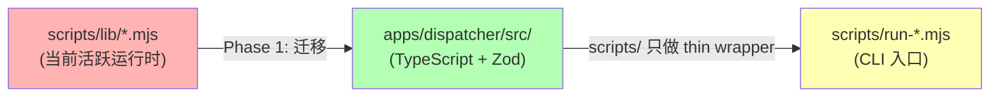
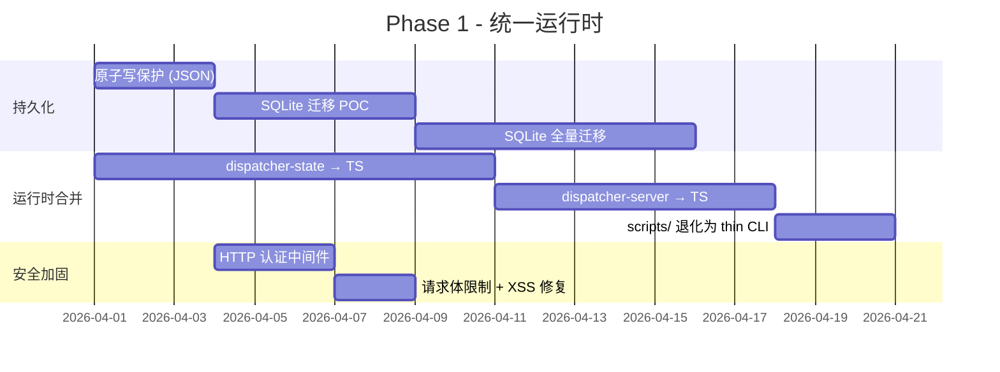
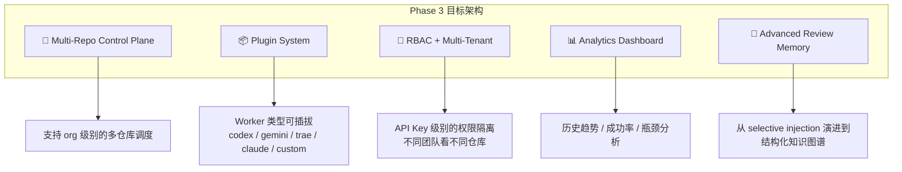

# ForgeFlow 架构审查与迭代路线图

> 审查基线：`main` 分支 `5608917` (2026-03-31)
> 代码规模：核心运行时 `scripts/lib/` 共 6,215 行 (.mjs)，`apps/dispatcher/` 含 TypeScript 领域层，`packages/` 下 11 个子包
> 状态更新：本文档已根据 `main` 在 `2026-04-02` 的实际实现做过一次收口标注；本文件仍然是 `plan/review`，不是权威实现说明。权威状态以 `README.md`、`docs/README.md`、`docs/ARCHITECTURE.md` 与代码为准。

---

## 一、项目现状总评

ForgeFlow 已经从"概念验证"阶段走到了"可跑通端到端链路"的阶段。当前主线支持：

- **Dispatcher → Worker Daemon** 的 codex/gemini 多机执行闭环
- **Trae automation gateway + worker** 的无人值守 Trae 驱动闭环
- **Review memory** 的选择性注入主线
- **Per-task worktree** 物化隔离
- 一个可发布的 `@tingrudeng/trae-beta-runtime` npm 包（当前已到 beta.31）
- `blocked + rework -> continuation` 的 dispatcher/Trae 主线协议与远程 smoke 验证

但在"能跑"和"可靠、可扩展、可维护"之间，存在若干系统性的架构债。以下按严重程度和迭代优先级排列。

---

## 二、核心问题分析

### 2.1 🔴 运行时权威分裂：`scripts/lib/` vs `apps/dispatcher/`

这是当前最大的架构债之一，但截至 `2026-04-02` 已经**部分解决**。

| 维度 | `scripts/lib/` | `apps/dispatcher/` |
|------|----------------|---------------------|
| 语言 | 纯 `.mjs` (无类型) | TypeScript + Zod |
| 运行时角色 | **真正的活跃 server/state** | 领域服务 + schema 常量 |
| 测试位置 | 测试在 `apps/dispatcher/tests/modules/server/` | 测试在同目录 |
| 依赖 | 无包管理，直接 import | 依赖 `@forgeflow/task-schema` 等 |

**当前状态更新**：
- `worker-daemon`、`review-decision`、`dispatcher-state`、`dispatcher-server` 主链已经桥接到 `apps/dispatcher/dist` 的 TypeScript foundation
- `scripts/*.mjs` 仍然是 live 入口与适配层，所以“分裂”没有完全消失，只是从“完全双轨”收敛成了“TS foundation + script adapter”

**剩余影响**：
- 新贡献者（包括 AI agent）极易改错层。改了 `apps/dispatcher/src/db/schema.ts` 以为改了 dispatcher，实际活跃路径在 `scripts/lib/dispatcher-state.mjs`
- 两层之间没有代码共享或接口契约，任何一侧的改动都可能变成"改了但不生效"
- 类型安全完全缺失：核心状态机 969 行、HTTP server 895 行均为无类型 `.mjs` 文件

**状态结论**：🟡 已部分完成，仍是活跃技术债

**方案**：



**本项完成情况**：
1. `dispatcher-state` → TS foundation：✅ 已完成
2. `dispatcher-server` → TS foundation：✅ 已完成
3. `scripts/run-dispatcher-server.mjs` 退化为 thin CLI wrapper：🟡 基本完成，但 live 入口仍在 `scripts/`
4. 两套实现并行期的 bridge/adapter 清理：🟡 仍有尾项

---

### 2.2 🔴 持久化层的"双轨困局"

当前并存两条持久化路径；不过截至 `2026-04-02`，主线已经从“JSON 唯一活跃路径”推进到“SQLite 默认 + JSON fallback”。

```
当前主线路径：
  .forgeflow-dispatcher/runtime-state.db     ← 默认 dispatcher 真相源（node:sqlite）
  .forgeflow-dispatcher/runtime-state.json   ← 显式 JSON fallback / SQLite 初始导入源
  .forgeflow-dispatcher/memory.json          ← review memory

仍会让人误读的路径：
  apps/dispatcher/src/db/schema.ts           ← SQLITE_SCHEMA_STATEMENTS（不是活跃 runtime persistence）
```

**当前剩余风险**：
- dispatcher 主线虽已默认切到 SQLite，但 review memory 和其他运行时存储仍是 JSON 文件
- JSON fallback 仍然存在，因此文档与实现都必须明确“默认 SQLite，不是彻底移除 JSON”
- 事件列表上限仍未完成，状态快照仍可能随运行时间增长
- 持久化 story 仍是 hybrid，而不是“所有状态都统一到一个 DB”

**状态结论**：🟡 核心目标已完成，仍有后续收口

**本项完成情况**：

**路径 A：SQLite 收口（推荐）**：✅ 已成为主线

```typescript
// 实现原子写 + WAL 模式
import Database from 'better-sqlite3';

const db = new Database(path.join(stateDir, 'dispatcher.sqlite'), {
  journal_mode: 'WAL',
});
// 所有状态变更在一个 transaction 中
db.transaction(() => { ... });
```

**路径 B：JSON + 原子写 + 锁**：⚪ 未作为主线路径推进；只落了最小原子写修复

```javascript
// 最小改动：加 write-file-atomic + 文件锁
import { writeFileSync as atomicWrite } from 'write-file-atomic';
import { lockSync, unlockSync } from 'proper-lockfile';
```

---

### 2.3 🟡 Trae Automation Gateway 的重复实现漂移

文档已记录（TECH_DEBT #3, KNOWN_PITFALLS #3），但问题在持续恶化：

| 对比点 | `scripts/lib/trae-automation-gateway.mjs` | `packages/trae-beta-runtime/src/runtime/` |
|--------|------------------------------------------|------------------------------------------|
| 行数 | 314 行 | ~500+ 行 (TypeScript) |
| `/v1/sessions/:id/release` | ❌ 缺失 | ✅ 有 |
| session store 路径 | `.forgeflow-trae-gateway/` | `~/.forgeflow-trae-beta/sessions/` |
| 错误处理 | 基础 try-catch | 结构化错误码 |
| Git SSH override | 部分支持 | 完整支持 |

**影响**：每次修 bug 都要在两处改，遗漏一处就会产生运行时行为岔开。

**当前状态更新**：
- 这一项仍未完成
- 但围绕 packaged runtime 的 readiness、target discovery、continuation、final report capture 已做了多轮真实修复，并发出了 `beta.23`~`beta.31`

**建议优先级**：🟡 P1（仍然成立）

**方案**：
1. 定义一个共享的 `AutomationGatewayProtocol` 接口（TypeScript）
2. 将公共逻辑提取到 `packages/automation-gateway-core/`
3. 两侧实现消费同一个核心库，只保留环境适配胶水代码
4. 新增跨实现一致性测试套件

---

### 2.4 🟡 安全与可靠性缺陷

#### 2.4.1 Dispatcher HTTP Server 无认证

```javascript
// dispatcher-server.mjs - 所有端点完全开放
if (method === "POST" && pathname === "/api/dispatches") {
  // 任何人都可以创建 dispatch，修改任务状态
}
```

**影响**：任何能访问 dispatcher 端口的人都可以注入恶意任务、篡改状态。

#### 2.4.2 无请求体大小限制

```javascript
async function readJsonBody(request) {
  const chunks = [];
  for await (const chunk of request) {
    chunks.push(chunk); // 无限累积，可被内存攻击
  }
}
```

#### 2.4.3 Dashboard HTML 内联存在 XSS 风险

```javascript
// 将原始数据直接拼接到 HTML 中
'<td>' + task.title + '</td>'      // title 中的 HTML 标签会被执行
'<div>' + JSON.stringify(event.payload) + '</div>'  // payload 可能包含恶意脚本
```

#### 2.4.4 Worker Daemon 的 GitHub Token 直接从 process.env 读取

```javascript
if (!process.env.GITHUB_TOKEN || changedFiles.length === 0) {
  return null;
}
// Token 以明文方式出现在进程环境变量中
```

**当前状态更新**：
- `QW-1` 原子写保护：已做
- `QW-2` 请求体大小限制：未做
- `QW-3` Dashboard XSS 修复：未做
- `QW-4` events 上限：未做

**建议优先级**：🟡 P1（仍然成立）

**方案**：
1. 添加 Bearer token / API key 认证中间件
2. 添加请求体大小限制（16KB）
3. Dashboard 使用 `textContent` 或 HTML 编码替代字符串拼接
4. Token 管理从 env 迁移到加密凭据存储

---

### 2.5 🟡 代码复杂度热点

以下文件是高复杂度 + 高变更频率的"热点"，重构优先级高：

| 文件 | 行数 | 问题 |
|------|------|------|
| [dispatcher-state.mjs](file:///Volumes/Data/code/MyCode/ForgeFlow/scripts/lib/dispatcher-state.mjs) | 969 | 无类型，immutable 深拷贝模式 + 大量 `...state` 展开，容易出错 |
| [dispatcher-server.mjs](file:///Volumes/Data/code/MyCode/ForgeFlow/scripts/lib/dispatcher-server.mjs) | 895 | 单文件 monolithic HTTP handler，Dashboard HTML 硬编码 289 行，Trae/Generic 路由混在一起 |
| [trae-automation-worker.mjs](file:///Volumes/Data/code/MyCode/ForgeFlow/scripts/lib/trae-automation-worker.mjs) | 897 | 多层 try-catch 嵌套的超时恢复逻辑，超 3 层的 fallback 链 |
| [trae-dom-driver.mjs](file:///Volumes/Data/code/MyCode/ForgeFlow/scripts/lib/trae-dom-driver.mjs) | 875 | 大量浏览器端 JS 以模板字符串形式嵌入服务端代码 |

**建议优先级**：🟡 P1（随 P0 迁入 TypeScript 时一起解决）

---

### 2.6 🟢 可观测性不足

当前可观测性仅限于：
- Dashboard HTML 页面（每 4 秒轮询）
- 本地 JSON 文件中的 events 数组
- console.log / console.error 日志

缺失：
- 结构化日志（JSON lines）
- Metrics（任务吞吐量、平均执行时间、失败率）
- Alerting（worker 长时间无心跳、任务卡在某状态超时）
- 分布式追踪（当多机部署时，请求链路不可追踪）

**建议优先级**：🟢 P2

---

### 2.7 🟢 MCP Packages 的"空壳"问题

`packages/` 下有 6 个 MCP server 包：

| 包名 | 状态 |
|------|------|
| `mcp-github` | 有入口，无实质实现 |
| `mcp-repo-policy` | 有入口，无实质实现 |
| `mcp-review-gate` | 有入口，无实质实现 |
| `mcp-scheduler` | 有入口，无实质实现 |
| `mcp-trae-worker` | 有实质实现，但已降级为 fallback |
| `worker-review-orchestrator-cli` | 有实质实现，活跃使用 |

大量声明了但未实现的包增加了新 agent 的认知负担——它们会尝试去使用这些包但发现是空的。

**建议优先级**：🟢 P2

**方案**：
- 暂时未实现的包移入 `packages/_future/` 或添加 `README.md` 明确标记 "NOT IMPLEMENTED"
- 或者在 `package.json` 中标记 `"status": "stub"` 然后在 `AGENTS.md` 中说明

---

## 三、迭代路线图

### Phase 1: 统一运行时 + 持久化收口（4-6 周）

**状态更新（2026-04-02）**：
- `dispatcher-state` → TS：✅
- `dispatcher-server` → TS：✅
- `scripts/*` 退化为 thin adapter / CLI：🟡 主链已基本成立，但入口仍在 `scripts/*.mjs`
- SQLite 迁移 POC：✅
- SQLite 成为默认 backend：✅
- 显式 JSON fallback：✅
- HTTP 认证中间件：❌ 未开始
- 请求体限制 + XSS 修复：❌ 未开始



**当前结论**：
- Phase 1 的“运行时合并到 TypeScript + 持久化默认切到 SQLite”可视为已完成
- 但 Phase 1 下原计划包含的“HTTP 认证 + 请求体限制 + XSS 修复”还没做完，因此若按原始大包定义，Phase 1 只完成了运行时/持久化子目标，不等于整包安全加固全部完成

---

### Phase 2: 可观测性 + 通信层升级（3-4 周）

**核心改动**：

#### 2.1 结构化日志
```typescript
// 引入 pino / winston
import pino from 'pino';
const logger = pino({
  level: process.env.LOG_LEVEL || 'info',
  transport: { target: 'pino-pretty' }, // dev only
});
```

#### 2.2 WebSocket 实时通信
当前 dashboard 每 4 秒 GET 轮询全量 snapshot。应改为：
```
Client ←→ WebSocket ←→ Dispatcher
              ↑ 增量事件推送
```

#### 2.3 Trae Gateway 实现合并
将两套实现合并到 `packages/automation-gateway-core/`

#### 2.4 Worker Daemon 健壮性增强
- 优雅关闭（SIGTERM handler + 完成当前任务后退出）
- Worktree 自动清理策略
- 更智能的 backoff 策略

**验证标准**：
- Dashboard 实现 sub-second 更新
- Worker 断线重连后状态正确恢复
- 旧 worktree 数量不超过配置上限

---

### Phase 3: 架构演进（长期）



#### 3.1 多仓库支持
当前 dispatcher 是单仓库假设（`runtime-state.json` 里所有 task 共享一个 flat namespace）。需要：
- Task 增加 `repoId` 索引
- Worker 注册时声明可服务的 repo 列表
- Dispatch 时按 repo 路由

#### 3.2 Worker 类型插件化
当前 worker 类型是硬编码的（codex/gemini/trae）。应该抽象出：
```typescript
interface WorkerAdapter {
  type: string;
  execute(task: Task, worktreeDir: string): Promise<ExecutionResult>;
  healthCheck(): Promise<boolean>;
}
```

#### 3.3 Review Memory 进化
从"flat lesson list + keyword match" → "结构化知识图谱 + embedding 相似度匹配"

---

## 四、未竞事项与快速修复建议

以下是不需要大规模重构、但能立即提升质量的改动：

### 4.1 立即可做 (Quick Wins)

| 编号 | 改动 | 当前状态 | 备注 |
|------|------|---------|------|
| QW-1 | `saveRuntimeState()` 原子写保护 | ✅ 已完成 | 先落在 JSON 路径；现主线默认已切 SQLite |
| QW-2 | `readJsonBody()` 加 16KB 上限 | ❌ 未完成 | `dispatcher-server.mjs` 仍未见请求体上限 |
| QW-3 | Dashboard HTML 的 `+` 拼接改用 `textContent` | ❌ 未完成 | `innerHTML` 拼接仍在 |
| QW-4 | 给 `events` 数组加上限（最多保留 500 条）| ❌ 未完成 | 仍未见主线事件上限 |
| QW-5 | 空壳 MCP 包加 `README.md` 标注 "NOT IMPLEMENTED" | ❌ 未完成 | 尚未系统清理 |
| QW-6 | `dispatcher-state.mjs` 中重复的 `targetWorkerId` 赋值修复 | ✅ 已完成 | 已保留 target routing 语义 |
| QW-7 | `.github/workflows/` 目录为空，补充 CI workflow | ❌ 未完成 | 仍是待补项 |

### 4.2 `createDispatch()` 中的逻辑瑕疵

```javascript
// dispatcher-state.mjs L424-L428
const task = {
  // ...
  targetWorkerId,      // Line 424
  // ...
  targetWorkerId,      // Line 428 ← 重复赋值
};
```

### 4.3 Dashboard HTML 应该从服务端代码中分离

当前 289 行的 HTML/CSS/JS 硬编码在 `dispatcher-server.mjs` 中。应该：
- 提取到 `apps/dispatcher/dashboard/index.html`
- 运行时 `fs.readFileSync()` 加载
- 或者用 Vite 构建一个轻量级 SPA

---

## 五、代码质量度量建议

### 5.1 当前测试分布

```
apps/dispatcher/tests/
  └── modules/
       ├── dispatch/     (1 文件)
       ├── doctor/       (1 文件)
       ├── execution/    (4 文件)
       ├── review/       (1 文件)
       ├── runtime/      (3 文件)
       ├── server/       (12 文件) ← 实际测试 scripts/lib/ 的行为
       └── tasks/        (1 文件)

packages/trae-beta-runtime/
  ├── test/              (2 文件)
  └── tests/             (3 文件) ← 两个测试目录，应统一
```

**建议**：
1. 测试目录应该与被测代码同侧（Phase 1 合并后自然解决）
2. `trae-beta-runtime` 统一测试目录到 `tests/`
3. 补充端到端集成测试：dispatcher ← worker daemon 完整闭环
4. 补充 Trae automation 的 mock 集成测试

### 5.2 建议引入的工具链

| 工具 | 用途 | 优先级 |
|------|------|--------|
| `eslint` + `@typescript-eslint` | 代码风格强制 | P1 |
| `prettier` | 格式化 | P1 |
| `vitest coverage` | 覆盖率报告 | P1 |
| `changeset` | 版本管理与 changelog | P2 |
| `github actions CI` | PR 门禁 | P0 |

---

## 六、文档与代码一致性评估

| 文档 | 准确性 | 备注 |
|------|--------|------|
| `AGENTS.md` | ✅ 高 | 规则清晰，覆盖面好 |
| `README.md` | ✅ 高 | 已同步 Phase 1 / Phase 2 / continuation 主线状态 |
| `docs/ARCHITECTURE.md` | ✅ 高 | 已同步 SQLite 默认与 continuation flow |
| `docs/API_ENDPOINTS.md` | ✅ 高 | continuation task metadata 已同步 |
| `docs/DATABASE_SCHEMA.md` | ✅ 高 | 已同步 SQLite 默认、JSON fallback 与 snapshot schema |
| `docs/TECH_DEBT.md` | ⚠️ 中 | 已补一部分，但仍不是完整债务清单 |
| `docs/KNOWN_PITFALLS.md` | ✅ 高 | 实用性强 |
| `docs/onboarding.md` | ⚠️ 中 | Trae 部分信息量大但可读性待优化 |
| `多智能体协作开发.md` | ⚠️ 低 | 仍描述的是 v1 设计愿景，部分已被当前实现超越（如 Fastify→原生 http、MCP server 未全部实现） |

**关键建议**：
- `多智能体协作开发.md` 应归档到 `docs/archive/` 或重写为反映当前实际的版本
- `docs/TECH_DEBT.md` 应补充本报告中发现的新债务项

---

## 七、总结与推荐优先级排序

```
┌────────────────────────────────────────────────────────────┐
│  Quick Wins (剩余)                                         │
│  ├── QW-2: 请求体大小限制                                   │
│  ├── QW-3: XSS 修复                                        │
│  ├── QW-4: events 数组上限                                  │
│  ├── QW-5: 空壳 MCP 包标记                                  │
│  └── QW-7: GitHub Actions CI                               │
├────────────────────────────────────────────────────────────┤
│  Phase 1（已完成主体）                                     │
│  ├── 运行时合并到 TypeScript                                │
│  ├── SQLite 持久化迁移                                      │
│  └── 剩余安全加固仍待补                                     │
├────────────────────────────────────────────────────────────┤
│  Phase 2 (3-4 周)                                          │
│  ├── 结构化日志 + Metrics                                   │
│  ├── WebSocket 实时通信                                     │
│  ├── Trae Gateway 实现合并                                  │
│  └── Worker Daemon 健壮性增强                               │
├────────────────────────────────────────────────────────────┤
│  Phase 3 (长期)                                            │
│  ├── 多仓库 Control Plane                                   │
│  ├── Worker 类型插件化                                      │
│  ├── RBAC + 多租户                                          │
│  └── Review Memory → 知识图谱                               │
└────────────────────────────────────────────────────────────┘
```

> [!IMPORTANT]
> 截至 `2026-04-02`，**Phase 1 的主干目标已经完成**：运行时主链已桥到 TypeScript foundation，dispatcher 默认持久化已切到 SQLite。当前最紧迫的剩余项已经变成：`QW-2/QW-3/QW-4/QW-7` 这类安全与可靠性补丁，以及 Trae gateway 双实现收口。
